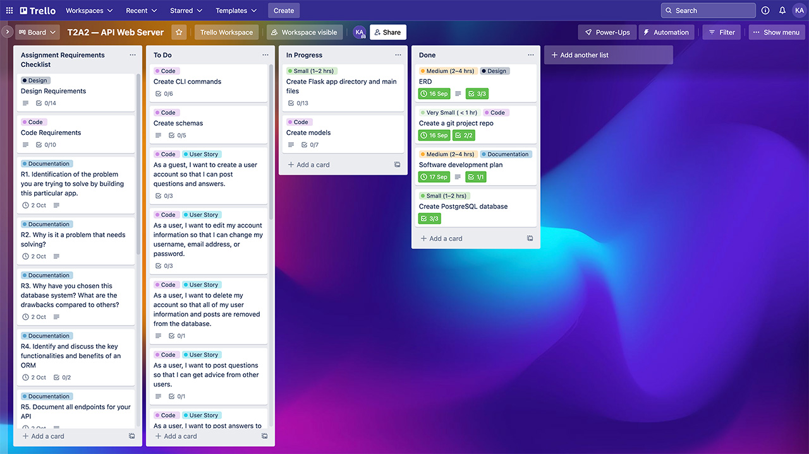
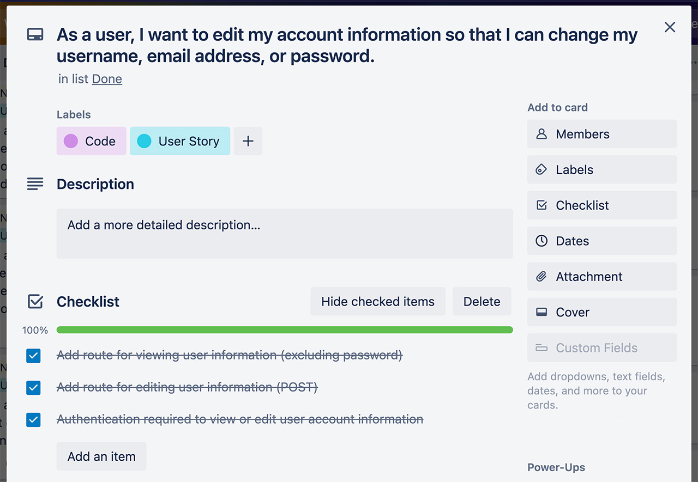

# Kobby Asomani | Coder Academy T2A2 | Web Server API
## Project documentation
### R1. Identification of the problem you are trying to solve by building this particular app.
This web server API is designed to act as an 'ask the locals'-style guide for places all over the world. Through user-generated question content, it creates a database of hyper-local knowledge about a place that anyone visiting or moving to that place can access. While many places have local forums/message boards, websites, blogs, and the like about them, this API would provide access to a central repository of local place FAQs (in a standard format) that could potentially be integrated with other applications and software services.

### R2.	Why is it a problem that needs solving?
Many of the questions about a very local place may not be answered by more general place guides or tourist guides that focus only on the major attractions of a place without giving much sense of practical daily life. Moving to a new place to live (especially a new country) can be a very different expereince from being a tourist, and it’s often useful to get more detailed advice about the local services that are available such as, public transport, entertainment and cultural venues, places to dine or buy food, general cultural customs, and so on.

This API is designed to provide access to a database of useful information about a very local place (down to the level of the suburb), in the form of a categorised question and answer system. Individual users would make use of the API by asking and answering questions, as well as recommending the best replies, and find out information about everything from the most recommended restaurants to eat at, to reliable trade services available in their local area. Other services such as maps and booking/short-stay websites and apps could also potentially draw on the API to provide more detailed place information that addresses FAQs many people might have about a local area.

### R3. Why have you chosen this database system. What are the drawbacks compared to others?
The database mangement system DBMS chosen for this web server API is [PostgreSQL](https://www.postgresql.org/). PostgreSQL is a relational DBMS, and is highly extensible with good interconnectivity with Python applications (via Flask-Sqlalchemy). It is free and open source, meaning there are no barriers to entry, its documentation is freely available and easily accessible, and there is a large community of contributors and users that make it easier to find usage examples, answers to questions, and troubleshooting advice. That said, being free and open-source the support available may not be comparable to that of other commercial competitors. Additionally, if we know in advance that we will be working with an object-oriented approach in our application, it may make more sense to use an object-oriented database (OOD) such as [MongoDB](https://www.mongodb.com/databases/what-is-an-object-oriented-database) that natively mirrors the models used in our application.

### R4. Identify and discuss the key functionalities and benefits of an ORM
The key functionalities and benefits of an Object Relational Mapper (ORM) are being able to access, query, and manipulate our database from within our Python application, using Python code. It also provides a range of useful shorthand methods for these maniuplations. In oboject-oriented programming (OOP), we typically define classes of objects with attributes (named properties and values that descripe the represented objects), and methods (functions that are part of a class definition, and therefore callable by instance objects of that class).

An ORM works by mapping model objects to database tables, with the attrbiute names and values of those objects representing the column names and values of tables in our databse. Theses attributes also have parameters which can be used to specify things such as the data-type of a column, and other constraints such as primary and foreign keys. One we have defined our models in this way, the ORM (in this case SQLAlchemy) interfaces with the database, using the model descriptions to generate tables. Since the models are a direct reflection of the database tables, references to their attrbiutes and methods can be translated into queries to database tables, columns, and rows. When we instantiate an object model, that instance represents a potential row from a table of its class, and we can use it to add new records to the database session and commit them, or use the attribute values of given model instances to join and filter tables when making queries.

In a nutshell, the tremendous benefit of working with an ORM is being able to easily write the application logic, and perform database queries and manipulations, using a consistent language and syntax.

### R5.	API Endpoint documentation
Broadly, the API is divided into endpoints for querying the database for inforamtion about users, questions, answers, and categories. Dynamic routes with URL paramteters, as well as query string arguments, are used to filter the results returned.

| Endpoint | HTTP Request Method | Required Data (Fields/Authentication) | Expected Response |
| ---------|---------------------|---------------|-------------------|
| / | GET | n/a | Return a welcome message with some infrmation about the API and a link to the documentation. |
| /help | GET | n/a |  Return this README.md file, or a 404 error message if not found. |
| /auth/register | POST | username (str), email (str), password (str) | Return a success message indicating that the user was created. |
| /auth/login | POST | username (str), password (str) | If authenticated, return an access token and the name of the user it belongs to. **This token will be needed to access routes that require authentication.**|
| /users | GET | **Authentication Required** | Get a list of users (includes user_id and username). |
| /users/\<user> | GET | **Authentication Required** | Get an individual user by user_id or username, including user_id, username, stat_answers_posted, stat)questions_posted and stat_recommendations_given. If the user being viewed is the logged-in user, also displays the email address. The \<user> path parameter an be either a user_id number (int) or a username (str). |
| /user/\<id>/account | PUT | Supply any of the fields: username (str), email (str), or new_password(str) to update details. The password (str) must be provided to update user accounts, but all other fields are optional. | A success message saying whether user details have been updated or remain unchanged. |
| /users/\<id>/questions | GET | n/a | Get all questions posted by a particular user. The \<user> path parameter an be either a user_id number (int) or a username (str). |
| /users/\<id>/answers | GET | n/a | Get all answers posted by a particular user. The \<user> path parameter an be either a user_id number (int) or a username (str). |
| /users/\<id>/q&a | GET | n/a | Get all queestions posted by a particular user. Unlike the /\<users>/questions path, this endpoint includes the answers associated with the question as nested fields. The \<user> path parameter an be either a user_id number (int) or a username (str). |
| /users/\<id>/recommendations| GET | n/a | Get all answers recommended by a particular user. The \<user> path parameter an be either a user_id number (int) or a username (str). |
| /users/\<id>/close| DELETE | **Authentication Required** | Delete a user account. The account being deleted must match the id of the logged-in user. The \<user> path parameter an be either a user_id number (int) or a username (str). |
| /questions/?\<query_string> | GET | n/a | Get a list of all questions in the database if no query string is supplied. If there is a query string, returns questions list filtered to match ALL values. Filterable attributes are: user_id (int), username (str), location_id (int), country_code (str), country (str, the country name), 2-character ISO 3166 code), state (str), postcode (str), suburb (str), category_id(int), and category_name (str). Spaces and ampersands in a query string value should be entered using the characters %20 and %26 respectively. |
| /questions/\<id> | GET | n/a | Get a single question by question_id. |
| /questions/\<id>/delete | DELETE | **Authentication Required** | Delete a single question by question_id. The logged-in user must match the id of the question author. |
| /questions | POST | **Authentication Required**. question (str); category_id (int) OR category_name (str); location_id (int) OR country_code (str), state (str), postcode (str), and suburb (str) if posting a new location. Currently, locations in Australia will be validated against existing locations in the database. For other countries, new locations can be created at the time of posting a question. | Returns a success message with a snippet of the newly posted question, and the category and location it was posted in. A question must be at least 20 characters long. |
| /questions/\<id>/answer | POST | **Authentication Required**. answer (str), Optional: parent_id (int) | Post a reply to a question. Returns a success message that a new answer has been posted to the given question. The path parameter must be a question_id (int). The parent_id of another answer can optionally be supplied if the answer is a reply to another answer, rather than a direct answer to the question. An answer must be at least 20 characters long.|
| /questions/\<id>/edit | PUT | **Authentication Required**. question (str) | Update (overwrite) the body of a question by id. Returns a success message saying the question has been modified. The logged-in user must match the author id of the question being edited. The path parameter must be a question_id (int).|
| /answers | GET | n/a | Get a list of all answers to all questions.|
| /answers/\<id> | GET | n/a | Get a particular answer and its replies by answer_id. The path parameter must be an answer_id (int). |
| /answers/\<id>/vote | POST | **Authentication Required** | Recommend an answer by id. Returns a success message saying the answer to a question has recieved your recommendation. A user can only give one recommendation to each answer. The path parameter must be an answer_id (int). |
| /answers/\<id>/remove-vote | POST | **Authentication Required** | Remove a recommendation from an answer by id. Returns a success message saying your recommendation has been removed. The path parameter must be an answer_id (int). A recommendation can only be removed by the user who gave it. |
| /answers/\<id>/edit | PUT | **Authentication Required**. answer (str) | Edit (overwrite) the body of an answer. Returns a success message if the answer has been updated. The path parameter must be an answer_id (int). An answer can only be edited by its author, and an must be at least 20 characters long. |
| /answers/\<id>/delete | DELETE | **Authentication Required** | Delete an answer. Returns a success message if the answer has been updated. The path parameter must be an answer_id (int). An answer can only be edited by its author, and an must be at least 20 characters long. |
| /categories | GET | n/a | Returns a list of all categories with category_id, category_name, and a description.
| /categories/\<id> | GET | n/a | Returns a list of all questions from the given category. The path paramter can be a category_id (int) or a category_name (str). 

### R6. Application Entity Relationship Diagram (ERD)

### R7. Detail any third party services that your app will use
#### Flask-Bcrypt
[Flask-Bcrypt](https://flask-bcrypt.readthedocs.io/en/1.0.1/) is an extension providing hashing and salting for data such as passwords. Passwords registered with user accounts are hashed by bcrypt before being stored in the database, and bcrypt is used to compare entered passwords against hashed passwords during user authentication.

#### Flask-JWT-Extended
[Flask-JWT-Extended](https://flask-jwt-extended.readthedocs.io/en/stable/) allows the creation and management of access tokens that control access to routes of the API requiring authentication. When a user registers, JWT is used to generate an access token specifically for that user, expiring in 24 hours. The user will need to provide a token in the request header when attempting to access routes requiring authentication. The get_jwt_identity() method is also used to ensure a user is only ever editing or deleting their own account or posts, by matching the id of the token against the id of the resource owner.

#### Flask-Marshmallow
[Flask-Marshmallow](https://flask-marshmallow.readthedocs.io/en/latest/) is a serialisation and deserialisation library used to help load and dump requests and responses by converting the SQLAlchemy model objetcs used to represent entities to and from JSON objects so that data can be enetered into or retrieved from the database in an interoperable format. Marshamllow is also used to validate request fields, for example ensuring submitted questions have a minimum length and are in string format.

#### Flask-SQLALchemy
[Flask-SQLALchemy](https://flask-sqlalchemy.palletsprojects.com/en/3.0.x/) adds support for SQLALchemy to a Flask application, so that database records can be queried and manipulated via an object-oriented approach in Python, rather than by writing SQL queries directly. By mapping SQLAlchemy model objects to database tables, we can use model attrbiutes and methods to retrieve data from the database, add records to a database session, and commit the changes to the databse in our Flask routes using Python functions and the database methods added by SQLALchemy's library.

#### Marshmallow-SQLALchemy
[Marshmallow-SQLALchemy](https://marshmallow-sqlalchemy.readthedocs.io/en/latest/) integrates SQLAlchemy with the Marshamallow library (described above) used for serialisation and deserialisation. In this web API, the SQLAlchemyAutoSchema model of this library was used to automatically generate schemas from the SQLaLchemy models already created. In some instances, additional schemas were created by deriving additional sub-classes from these auto-generated schemas to show or hide certain fields in certain views.

#### Psycopg2
[Psycopg2](https://www.psycopg.org/docs/) is a databse adapter for Python, used here to connect the PostgreSQL database used by the API for storage and retrieval, and running on localhost port 5432, with the Flask server running localhost port 5000 and receiving requests.

#### Python-dotenv
[Python-dotenv](https://pypi.org/project/python-dotenv/) is used to configure the environment in which the web server API app runs. It takes the key-value pairs holding some configuration settings from the .env file in the root directory (e.g., the application creation function name and package, database connection string, JWT secret key, and Flask test and debug settings), and makes them available to the environment.

#### GeoNames
[GeoNames](https://www.geonames.org/) is a free geographical database that aims to cover places all over the world, with data including placenames and zip codes. all countries and the Australian locations seeded in the database were retrieved from Geonames. 

### R8. Describe your projects models in terms of the relationships they have with each other
 Since this API is essentially about storing quesitons, and answers related to a place, the question model was an important entity to define early. A question has an author (represented by the user_id as a foreign key), a location (represented by the location_id as a foreign key), a categroy (represented by the category_id as a foreign key), a datetime to track when it was posted, and afinally a question body containg the text of the question.

In order to post a question or answer, or give a recommendation, a user must create an account, and the User model contains an id, username, email, and password associated with a given user.

Questions are also posted in specific categories, so the Categories model contains an id for each category, a category name, and a category description.

The answers to a question contain the id of the user who posted them, the id of the question they are associated with, and a parent id, which is only required if the answer is a reply yo another answer, rather than a direct reply to the question. It also includes a timestamp and a body containing the text of the answer.

A recommendation is used to record a relationship between a particular answer, and a user who has recommended it. The inital model had recommendations as an attribute of the Answers model, but a counter alone would make it difficult (if not impossible) to know which users have recommended a given answer, and also to prevent a single user from recommending an answer multiple times, and so recommandations have been factored out into their own table.

A location is made up of an id, as well as a country code, state, postcode, and suburb. Countries are stored in a separate table, with a country code and country name, passing only their country code to a location as a foreign key.

### R9. Discuss the database relations to be implemented in your application
As this API service is based primarily around questions, the Questions model is central, and has the most relationships with the other models. A question has answers (a one-to-many relationship with the answer table).

The user_id of a user is passed to any other entity they create, and a user can post a question, an answer to a question, or recommend another user's answer. As such the User model has a one(and only one)-to-many relationship with Questions, Answers, and Recommendations.

While many questions can share the same category, a question has one (and only one) category, so a Categories has a one-and-only-one-to-many relationship with Questions.

A question gets its location id as a foreign key from the locations table, which in turn gets its country code from the countries table. A location can have many questions associated with it, and so has a one-(and only one)-to-(zero or)-many relationship with Questions.

A question can have many answers, and as such has a one-(and only one)-to-many realtionship with Answers.

An answer has one (and only one) question, but may itself have many answers (replies). The parent_id attribute of an aswer keeps track of whether the answer is a reply to anoahter answer. In the application, this is represented using a self-referential field which displays the nested replies to a given answer.

An answer can also have many recommendations. Because recommendations are stored in a separate table, tallying the number of recommendations given to a particlar answer invovled defining a method in the Answer class that checks how many recommendations are associated with a given answer, and returns it as an integer to a nested field.

### R10. Describe the way tasks are allocated and tracked in your project
Tasks for this project were tracked using a Kanban-style Trello board, where each application feature to be developed was expressed as a user story on a card. For example, the /questions endpoint and filtering functions were based on the suer story: "As a user, I want to view all of the questions and answers for a particular place and/or category so I can find relevant information."

The design, code, and documentaiton requirements, were all broken down into cards, with the 'code' cards being moved between the "To Do", "In Progress", and "Done" columns as the app was developed. Labels were used to differentiate between cards belonging to code/user stories, design, and documentation. Within each card, checklists were used to track the sub-tasks that would need to be completed in order for the user story to be adequately satisfied.

The "Assignment Requirements Checklist" list was used as a checklist at the end of the project, to review marking criteria for each requirement and make sure all of the coding and documentation requirements had been met. [View the Trello board](https://trello.com/b/QZZ2i2Uc/t2a2-api-web-server) for the project.

